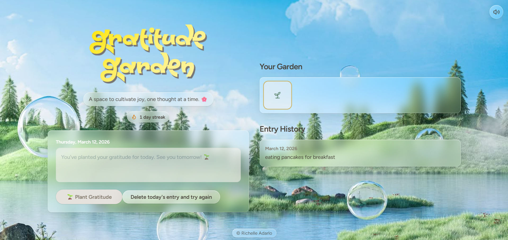

#  Gratitude Garden

Gratitude Garden is a calming web app that encourages daily reflection by turning gratitude entries into a growing virtual garden. Each day a user writes something they are grateful for, a new seed is planted in the garden, visually representing their gratitude journey over time.

##  Features

- **Daily Gratitude Entry**
  - Users can write one gratitude entry per day.
  - The app displays the current date for each entry.

- **Garden Visualization**
  - Each entry plants a seed in the garden.
  - The garden grows as more entries are added.

- **Entry History**
  - Displays previous gratitude entries with dates.
  - Users can revisit past reflections.

- **Growth Animation**
  - When a user plants a seed, a simple animation shows the seed appearing in the garden.

- **Local Storage**
  - Entries are saved in the browser using `localStorage` so data persists after refreshing the page.

##  Tech Stack

- **React**
- **Vite**
- **Tailwind CSS**
- **LocalStorage API**

##  How It Works

1. The user writes one gratitude entry for the day.
2. When they click **Plant Seed**, the entry is saved.
3. A seed icon appears in the garden.
4. As more entries are written, the garden continues to grow.

##  Future Improvements

- Plant growth stages (seed → sprout → flower)
- Gratitude streak tracker
- Seasonal garden themes
- Ability to edit past entries
- Cloud database support (Firebase or Supabase)

##  Purpose

This project combines **mindfulness and visual motivation** by transforming daily gratitude into a living digital garden. It is designed to promote positive habits while providing a simple and relaxing user experience.

## License

MIT

Developed by Richelle Adarlo <3
